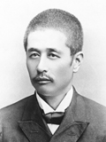
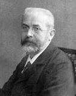
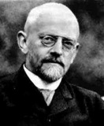
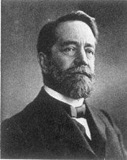

# Retrospect and Prospect

## speech by [Teiji Takagi](https://www.aozora.gr.jp/cards/001398/files/50907_41899.html), December 7th, 1940

An old man's retrospect is usually based on hazy recollections of his past days.
Such retrospect must be ambiguous, because recollections are subjective.
As his subjectivity itself changes with time,
it gets more and more ambiguous.
Thus I declare from the beginning that my retrospect below is unreliable.
Subjectively and egocentrically, I shall recollect my past days.

I entered the University of Tokyo in 1894, which was the year of the Sino-Japanese War.
For later reference, I mention the years 1904 and 1914 of
the Russo-Japanese War and World War One, respectively.
These numbers are easy to remember.
Anyway, I left my hometown and came to Tokyo in 1894.
At the time, there were two professors,
Dairoku Kikuchi and Rikitaro Fujisawa, in the department of mathematics.
What did I learn then?
Calculus and analytic geometry were compulsory subjects for freshmen.
When a sophomore, I learned Durège's "Theory of Elliptic Functions."
This is so old a book that you may not have seen it.
The book was an easy commentary on Jacobi's famous "Fundamenta Nova,"
and is outdated now.
I guess that the syllabus was imported from Cambridge 
in the early days of the Meiji era.
I also learned Salmon's "Higher Plane Curves,"
without knowing that it was actually about projective geometry.

In that way I spent the first two years of the student life.
In those days, students of mathematics were given a lot of freedom.
Professor Fujisawa said "Lehr- und Lernfreiheit" (freedom of teaching and learning) in German,
and recommended that students read whatever books they like.
So I read a lot of mathematical books.
In the third year, professor Kikuchi moved to the Ministry of Education.
Professor Fujisawa was left alone, and there were very few lecture hours.
At one time, students were crammed with knowledge,
though cramming has been somewhat reduced now.
Compared with students at the time, I was given more freedom.
Spending two more years freely, I was enrolled in the university for four years from 1894 to 1898.
During those years I read a lot of books randomly without a guide.
I'd rather say that I just leafed through all the books in the library.
Thus my learning was incomplete.

Professor Fujisawa had a deep knowledge on algebra.
He had studied abroad and heard Kronecker's lectures in Berlin.
He always said that algebra should be taught more deeply in universities.
At that time in Japan, algebra was regarded as finished in high school.
Attending his seminar, I was given a lot of problems on algebra.
At the time, Serret's "Higher Algebra" was a popular book.
I was told to read the book's section on Abelian equations,
from which I went into hard training of higher algebra.
Then I found Weber's "Textbook of Algebra, volume 1" at a corner in the library.
I learned Galois' theory from the Weber's book, though I am not sure whether I understood it.
Weber's second volume came to the library before my graduation.

In 1898, I was told to study abroad. First I went to Berlin, Germany.
In that year, there was the resignation of the cabinet,
and a party cabinet was organized (by Ohkuma and Itagaki) for the first time in Japan.
On resigning, Mr. Shoichi Toyama, the Minister of Education, announced 
that more than ten students would study abroad for one year.
Fortunately I was one of the students, and was told to go abroad earlier than I expected.

I was glad that I could travel to Western countries.
I was also afraid that staying in Berlin would be tough.
Western scholars were revered like gods then.
Just before I came to Berlin, there flourished mathematics under 
the three gods: Weierstrass, Kronecker, and Kummer.
The three all had been dead, and their successors were
Fuchs, Schwarz, and Frobenius.
At that time, Germany was a center of mathematics,
and Berlin was a center of German mathematics.
I was scared to go into the center of mathematics,
because I was an Eastern countryman who had neither grounding nor confidence.
When I got to Berlin, Fuchs and Schwarz were very aged.
They were almost reaching the retirement age if in Japan.
I heard Fuchs' lecture on "the solution of differential equations by a power series,"
which was based on his article in Crelle's journal, volume 66.
On the blackboard, he wrote a circle that represented the radius of convergence of the power series.
But the circle got stuck on the edge of the blackboard,
and didn't reach a singular point at which the series diverges.

Schwarz lectured on various topics too.
In almost every lecture, he repeated "Herr Professor Weierstrass pflegte zu sagen ..."
(Weierstrass often said this and that).
By this he meant that mathematics in his lectures
derived directly from Weierstrass without any adaptation.
In the first lecture on the theory of functions,
he introduced the Weierstrass' viewpoint of irrational numbers.
I thought that such an introduction was somewhat old-fashioned.
For the most part, these lectures were not much different
from what I learned in Tokyo.

Frobenius was youngest among the three.
He lectured on Galois' theory and number theory,
whose contents were not particularly unusual.
But his lecturing style was really brisk.
He lectured without notes.
For the first time since I was born, I heard living lectures from him indeed.
I was a little scared of Frobenius because of the following.
A while before my leaving for Germany, 
a few young professors in the college of science returned from abroad.
I thought that I'd better get advices from the professors about what I should be careful to.
One of the professors advised me "you should be careful to Frobenius if you meet him."
According to the professor, Frobenius said following things when he became a dean.
In the inaugural speech, he boasted of the progress of German science.
Many foreign students came to Germany to study science.
Students came not only from America but also from everywhere else.
These days they came even from Japan.
Sooner or later monkeys would come too...
Surely he shouldn't have said such things in a public speech.
Probably the professor exaggeratedly advised me.

Thus I was told to be ready for Frobenius who might despise Japanese.
But when I met him in person, I was not so scared.
When I asked him some questions, 
he said "Das ist interessant. Denken Sie nach!" (That's interesting. Think further),
and lent me a lot of relevant offprints from journals.
This "Denken Sie nach" was also a lesson that I got from him for the first time in my life.
At that time Frobenius was studying the theory of group characters.
But he spoke nothing about group characters in his lectures, seminars, and colloquiums.
That is, he didn't seriously take not only monkey-like Japanese but also German students.
He didn't exhibit his treasures to students.
So I was ignorant of Frobenius' group theory while I stayed in Berlin.

In that way I spent three semesters in Berlin without incident.
In those days, the cultural difference between the East and the West was so large that
I couldn't help spending my time in language lessons and
in getting accustomed to the European lifestyle.

In 1900, I moved to Göttingen.
At that time, there were two professors of mathematics, Klein and Hilbert, who had a chair in Göttingen.
It was much later that the third chair was created for Minkowski.
I was surprised that the atmosphere of Göttingen was totally different from that of Berlin.
At Göttingen, mathematical colloquium was held once a week.
The colloquium was the center of the world of mathematics,
in which the very best mathematicians gathered not only from Germany but also from all over the world.
Not until the age of twenty five, did I realize keenly that I was fifty years behind 
the current state of mathematics.
It seemed difficult for me to catch up with the current state in a year or two.
But, within the three semesters (one and a half years) that
I spent in the atmosphere of Göttingen, I got a feeling that I caught up with it.
An atmosphere is important.

When I met Hilbert, he was very skeptical about my study, saying 
"are you really going to study algebraic number theory?"
In those days, algebraic number theory was studied in almost nowhere except Göttingen.
So it wasn't unnatural to doubt whether an Easterner would study it.
As soon as I replied that I would study it, he gave me an oral exam:
"what are algebraic functions determined by?"
While I couldn't answer immediately, he answered himself
"they are determined by Riemann surfaces."
Agreeing to him, I said "ja, ja" (yes, yes).
I guess that he thought me dubious.
Then Hilbert said that he would go home and told me to accompany him.
While we walked, I said to him: "I am going to study about Kronecker's 'Jugendtraum'
(dream of youth), and especially about
complex multiplication of the lemniscate function
that has Gauss' number field as its base field."
He said "sounds good." 
At the corner of the Wilhelm-Weber street, he wrote on the road a square and a circle with his stick.
Then he wrote a figure that represented a conformal mapping from the square
into the circle by the lemniscate function. I can still remember this scene clearly.
He reproduced the figure from Schwarz's "Werke" (works).
He continued the oral exam: "since you came from Schwarz's place,
you must be familiar with this conformal mapping."
Actually I wasn't very familiar with it.
When I came to Göttingen, Hilbert was far away from number theory.
In 1900, he had just finished "The Foundations of Geometry."
In 1904, he studied on integral equations and began constructing
the theory of Hilbert space.
I met him in the intermediate period of time,
when he was studying on the calculus of variations and differential equations of theoretical physics.
His studies in this period are now inherited by Courant.
In such a period, I didn't get a direct supervision from Hilbert.

Thus I returned to Japan meekly, in contrast to the vigor with which I left Japan.
Before I returned, I wrote an article on the lemniscate function and showed it to Hilbert,
though it was an immature article.
Hilbert seemed to regard the article as my doctoral thesis.
At that time, Japan was developed enough, so
I didn't have to get a doctoral degree from a German university.
I got the degree in Tokyo by this article.
The article was the only souvenir that I brought from Germany.

When I returned in 1901, I was given duties of giving a lot of lectures.
I gave lectures on algebraic curves and some other subjects that I don't remember.
Lectures reduce free time of students.
So I probably gave inconvenience to all of you who were students at the time.
After the professors Yoshie and Nakagawa returned from abroad,
such extra duties decreased somewhat.

I am a kind of man who can do nothing without stimulus.
Stimulus was much rarer than it is now, because there were fewer colleagues then.
In such an era I could idle my time away.
You may think that I came up with the "class field theory" during those idle days.
But the truth is not so simple.

In 1914, World War One began. The war gave me a good stimulus in the negative direction.
That is, books stopped coming from Europe.
I heard someone say that it would be impossible to study in Japan without books from Germany.
Newspapers pitied and ridiculed those scholars who couldn't study any more.
Those who would continue to study without Western books must stand on their own feet.
If it had not been for World War One, I would have ended with no work.
Incidentally, I tell you an episode which I now happened to remember.
I remember someone said something like this:
"If one has been a professor in a university for ten years, he must have a nervous breakdown,"
the meaning of which is as follows.
Books come from abroad frequently.
Every month many books arrive in, say, Maruzen bookstore.
It is hard to check what kinds of books newly appear, and not to overlook them.
It is even harder to buy and read them all.
These are the reason for the nervous breakdown.
There are so many authors of books on earth,
that it is unwise to feel compelled to read them alone.
Fortunately I have never had a nervous breakdown,
because I am so lazy by nature that I read few books by others.
To prevent a nervous breakdown, I advise you not to read too much.

To talk about the class field theory, I was deceived by Hilbert about it.
More precisely, I was deceived by my belief in Hilbert's words. I was misled by his words.

Hilbert said that class fields are unramified.
It makes a big difference whether class fields are unramified,
to those who take his viewpoint: "algebraic functions are determined by Riemann surfaces."
Hilbert made me believe that it makes a big difference,
though I don't know whether he believed so.
When books stopped coming from Europe, I thought about it further.
Disregarding the condition of unramification,
I discovered that an Abelian extension induces a class field.
This discovery is now reformulated as the "Umkehrsatz" (reverse theorem) by Hasse.
At that time, this theorem was so unexpected to me that I thought I made a mistake.
So I first tried to spot where I made a mistake. I felt I got close to nervous breakdown then.
I often had a dream in which I solved this problem.
But when I woke up, I found myself not solving it at all.
At last, I couldn't find any counterexample which would disprove my discovery.
I had so long been searching for my mistake,
that I didn't have confidence in the theory which I built on my discovery.
A tiniest mistake would destroy the whole theory, like the burrowing of an ant.
In mathematics, an "almost satisfactory" theory is unacceptable,
though it may be acceptable in sciences other than mathematics.
Around me there was no one to check the correctness of the theory.
In 1920, I got a chance to let the theory be checked.
That year I went abroad on sabbatical.
I wrote an article in a hurry, to bring it to the International Congress of Mathematicians in Strasbourg.
Printing the article wasn't done before my going abroad,
so I asked an assistant to ship the article to the congress.
The congress was held just after the war,
when Germany was isolated by the Allied Powers.
In such times, the atmosphere in Strasbourg was unfit for a talk about number theory.
Among the participants, there were only a few people who would understand the class field theory.
As far as I knew, Fueter from Switzerland, Chatêlet from France, and Hadamard from France
would understand it. Hadamard understands any problem, whether interested in it or not.
They were nearly the only participants whom I could count on.
A reception was held at night before the congress.
There I heard someone whisper around me: "The Japanese man talks about number theory.
Perhaps he will talk about the Fermat's last theorem. It's going to be fun."
I couldn't hide a grin. I talked for about fifteen minutes in the congress.
Of course, there was no response.

A while after the congress, in 1921, I went to Germany, and visited Hamburg University.
At that time, Hecke and Blaschke were the professors of mathematics in Hamburg.
My article had been there. I saw a female assistant reading my article.
Hamburg was among the earliest places where the class field theory was read.

It's not clear whether Hilbert read the class field theory as early as Hamburg.
Since 1898, Hilbert was far away from number theory, after he wrote the "Zahlbericht" (report on numbers).
In about 1932, the collected works of Hilbert were edited.
Mrs. T. who helped the editing asked him about an unclear point in the Zahlbericht.
To her surprise, Hilbert couldn't make out the point too.
She felt it strange that he forgot his own writings.
It was not at all strange. Hilbert was so far away from number theory.
I got a letter from Hilbert in 1925 or 26.
In the letter he proposed that my article would be reprinted in "Mathematische Annalen."
He also wrote: "I read your article for the first time in preparing my lectures on algebraic number theory."
Between "article" and "for", he inserted "ausführlich" (in detail) by hand.
Maybe he felt it impolite to read my article five years after receipt in 1920,
and tried to erase the impoliteness by saying "in detail for the first time."
I thought that Hilbert had a scrupulous mind in spite of his appearance.
The letter made me smile.
I don't know whether Hilbert really gave the lectures on algebraic number theory.
If he did, there must be someone who took notes of the lectures.
I have long been thinking to inquire whether there is someone who saw the notes.
I don't have a chance to inquire yet.

I'd like to talk a little about Klein. The time goes back for a while.
Klein's lectures were crowded with audience then.
At that time, the system of German universities was such that
a student could freely choose what lectures to hear.
To decide whether to hear or not, students could attend lectures for first six weeks for free.
A student had to pay only for those lectures which he decided to hear.
I had fun hearing Klein's lectures. To tell the truth, I had never paid for his lectures.
I quitted hearing after the first six weeks which were enough for me.
But these six lectures were very helpful for me to catch up with the current state of mathematics.
I guess that the subsequent lectures after the seventh wouldn't be very helpful.
Anyway, the outline in his first lecture was very interesting.
I may well say that Klein foresaw the current state of mathematics by himself forty years ago.
Klein often said "three capital A's," which are initial letters of Arithmetic, Algebra, and Analysis.
By this he meant that mathematics was separated in three guilds,
which he intended to unify by his geometrical point of view.
Although he didn't definitely say so, his intention of unification 
was apparently the basic theme in the first six lectures.
If students of mathematics today were told "there are three capital A's in mathematics,"
they would disagree.
They would say "now there is only one small a," that is, abstract.
Contemporary mathematics is regulated by abstract methods.
Forty years ago, Klein already began regulating mathematics by his geometrical methods
"im Kleinen" (on small scales). Thus his name was Klein.
This is a bad joke, but isn't ridicule.
In fact, this is an expression of love and respect for Klein.
Klein often said "leere Allgemeinheit" (empty generalization).
This is a capital A too.
By these words he probably criticized superficial and useless generalizations.
If Klein lived now, would he say that abstract methods of contemporary mathematics are empty?
I think not. Klein demanded that everything be concretely expressed,
so he didn't understand a thing until he concretized it.
Concretion and abstraction seem opposite to each other,
but are both necessary for the unification of mathematics.
What mathematicians must avoid is shallow- and narrow-mindedness.

As I have long talked on "retrospect", the remaining time for "prospect" gets shorter.
But, rather than to tell a vague prospect, let me continue my retrospect a little longer.
Around 1930, several top-class mathematicians from the West visited Japan
one after another within a few years. I still remember their visit clearly.

Since we knew mathematician's way of thinking,
we didn't hold such a banquet as to gather celebrities from academic circles.
Rather, we always held colloquiums by ourselves, in a mountain hut or in a bachelor's hall.
The visitors were served Western cooking, such as fried salmon with a stink of mayonnaise.
Maybe they thought the cooking to be Japanese cuisine when they ate it.
The visitors all looked satisfied when they left Japan, in spite of such odd services.
Afterward, in Zürich, I met one of the visitors.
There he said to me "Japanese mathematics will grow a lot in twenty years."
I asked him why. He said "Look at America. Twenty years ago, there was nothing of
mathematics in America. But today it's growing fast. Also in Japan,
mathematics will surely grow a lot in twenty years..."
It sounds like a weak prediction, but he predicted so probably because
he saw some good points in Japanese mathematicians.

Another visitor, who also ate fried salmon, sent me a letter after leaving Japan.
He wrote that he was deeply impressed by Japanese mathematics,
and that Japan is especially rich in good young mathematicians
(reich an guten jungen Kräften), as I recall.
He also wrote that he envies (beneiden) us for good works (Arbeiten)
which young mathematicians will conduct in the near future.
Thus Western mathematicians expect very much of young Japanese mathematicians.
I think that their observations may well represent the prospect for our future.

Watching the brilliant activities of young mathematicians,
I now have the greatest pleasure of expecting a bright future of Japanese mathematics.

(speech at mathematical colloquium, University of Tokyo, December 7th, 1940)

---

History repeats. Twenty years after World War One, another world war has begun.
This may be a continuation rather than a repetition.
The import of academic books and journals has been interrupted again.
Abstract methods of modern mathematics, which arose after the former world war,
gradually prompted the thorough revision of classical mathematics.
The new methods have now just begun working,
so no one can tell how mathematics evolve in the future under the new methods.
But it is an undeniable fact that the new methods have already achieved
some remarkable and meaningful results.
The start of new mathematics has been somewhat dampened
by the war that interrupts academic correspondences.
I sincerely hope that Japanese mathematicians' works during this hard time
will contribute to the postwar development of new mathematics.

(postscript on January 10th, 1942)

